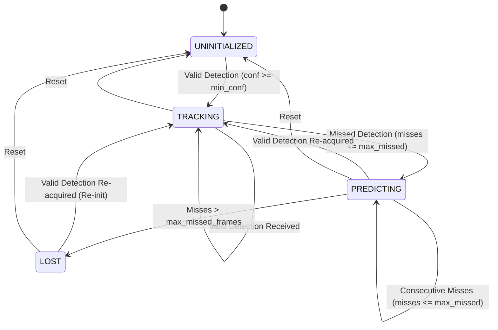

# Beacon Tracking & Motion Prediction Specification (Module 6)

**FSOC AI-Based Virtual Camera Tracking Project**  
**Team PHARO — Smart India Hackathon (SIH26169)**

---

## 1. Purpose & Overview

The **Beacon Tracking & Motion Prediction Module** is the focal-plane kinematic state estimation stage of the Free-Space Optical Communication (FSOC) coarse alignment testbed. Its primary objective is to receive noisy, jittered, and potentially intermittent 2D beacon detection centroids $(\hat{u}_k, \hat{v}_k)$ from the **Beacon Detection Module (Module 5)** and produce optimal, smooth estimates of:

1. **Beacon image position**: $(\hat{p}_x, \hat{p}_y)$ in pixel coordinates.
2. **Beacon image velocity**: $(\hat{v}_x, \hat{v}_y)$ in pixels per second.
3. **Predicted future trajectory**: $(\hat{p}_{x,\text{pred}}, \hat{p}_{y,\text{pred}})$ for latency compensation.
4. **Tracking confidence**: $c_{\text{track}} \in [0.0, 1.0]$ considering detector confidence, hit streaks, and state covariance.
5. **State status**: `UNINITIALIZED`, `TRACKING`, `PREDICTING` (coasting), and `LOST`.

> [!IMPORTANT]
> **Strict Principle: Ground-Truth Isolation**  
> The Kalman Tracker operates solely on `DetectionResult` measurements from Module 5 and its own recursive internal covariance matrices. Ground-truth platform or beacon 3D positions are **never** accessed or leaked into the estimation filter.

---

## 2. State Space & Mathematical Formulation

The tracker is formulated as a discrete-time **2D Constant-Velocity Linear Kalman Filter (CV-KF)**.

### 2.1 State Vector

The 4-dimensional state vector $\mathbf{x}_k \in \mathbb{R}^4$ is defined as:

$$\mathbf{x}_k = \begin{bmatrix} p_x \\ p_y \\ v_x \\ v_y \end{bmatrix}$$

where:
* $p_x$: Horizontal beacon focal-plane position (pixels)
* $p_y$: Vertical beacon focal-plane position (pixels)
* $v_x$: Horizontal focal-plane velocity (pixels/second)
* $v_y$: Vertical focal-plane velocity (pixels/second)

### 2.2 State Transition Model (Prediction)

For elapsed simulation time $\Delta t = t_k - t_{k-1}$, the kinematic state transition matrix $\mathbf{F}(\Delta t)$ is:

$$\mathbf{F}(\Delta t) = \begin{bmatrix} 1 & 0 & \Delta t & 0 \\ 0 & 1 & 0 & \Delta t \\ 0 & 0 & 1 & 0 \\ 0 & 0 & 0 & 1 \end{bmatrix}$$

The continuous white-noise acceleration model yields the discrete process noise covariance matrix $\mathbf{Q}(\Delta t)$ parametrized by continuous acceleration spectral density $q$:

$$\mathbf{Q}(\Delta t) = q \cdot \begin{bmatrix} \frac{\Delta t^3}{3} & 0 & \frac{\Delta t^2}{2} & 0 \\ 0 & \frac{\Delta t^3}{3} & 0 & \frac{\Delta t^2}{2} \\ \frac{\Delta t^2}{2} & 0 & \Delta t & 0 \\ 0 & \frac{\Delta t^2}{2} & 0 & \Delta t \end{bmatrix}$$

**Prediction Equations:**
$$\hat{\mathbf{x}}_k^- = \mathbf{F}(\Delta t) \hat{\mathbf{x}}_{k-1}$$
$$\mathbf{P}_k^- = \mathbf{F}(\Delta t) \mathbf{P}_{k-1} \mathbf{F}(\Delta t)^T + \mathbf{Q}(\Delta t)$$

### 2.3 Measurement Model (Update)

The detector measurement $\mathbf{z}_k \in \mathbb{R}^2$ provides observed sub-pixel coordinates:

$$\mathbf{z}_k = \begin{bmatrix} z_x \\ z_y \end{bmatrix} = \begin{bmatrix} \hat{u}_k \\ \hat{v}_k \end{bmatrix}$$

The linear measurement mapping matrix $\mathbf{H}$ is:

$$\mathbf{H} = \begin{bmatrix} 1 & 0 & 0 & 0 \\ 0 & 1 & 0 & 0 \end{bmatrix}$$

The measurement noise covariance $\mathbf{R}_k$ is adaptively scaled by detector confidence $c_{\text{det}}$:

$$\mathbf{R}_k = \frac{r}{\max(0.1, c_{\text{det}})} \begin{bmatrix} 1 & 0 \\ 0 & 1 \end{bmatrix}$$

**Update Equations:**
* Innovation (measurement residual):
  $$\mathbf{y}_k = \mathbf{z}_k - \mathbf{H} \hat{\mathbf{x}}_k^-$$
* Innovation covariance:
  $$\mathbf{S}_k = \mathbf{H} \mathbf{P}_k^- \mathbf{H}^T + \mathbf{R}_k$$
* Kalman Gain (numerically solved via linear system):
  $$\mathbf{K}_k = \mathbf{P}_k^- \mathbf{H}^T \mathbf{S}_k^{-1}$$
* Updated State:
  $$\hat{\mathbf{x}}_k = \hat{\mathbf{x}}_k^- + \mathbf{K}_k \mathbf{y}_k$$
* Joseph Form Covariance Update (guarantees positive semi-definiteness):
  $$\mathbf{P}_k = (\mathbf{I} - \mathbf{K}_k \mathbf{H}) \mathbf{P}_k^- (\mathbf{I} - \mathbf{K}_k \mathbf{H})^T + \mathbf{K}_k \mathbf{R}_k \mathbf{K}_k^T$$

### 2.4 Lead Extrapolation (Motion Prediction)

To compensate for camera exposure latency and gimbal actuator delay, the tracker predicts the future focal-plane state at lead time $\tau$:

$$\hat{\mathbf{x}}_{\text{pred}}(\tau) = \mathbf{F}(\tau) \hat{\mathbf{x}}_k = \begin{bmatrix} \hat{p}_x + \hat{v}_x \tau \\ \hat{p}_y + \hat{v}_y \tau \\ \hat{v}_x \\ \hat{v}_y \end{bmatrix}$$

---

## 3. Tracking Lifecycle & State Transitions

The tracker manages 4 operational states:



### State Definitions

1. **`UNINITIALIZED`**:
   - Initial state before any valid beacon spot has been localized.
   - State and covariance are uninitialized.
   - Confidence = 0.0, tracking = False.

2. **`TRACKING`**:
   - Valid detector measurement was received in the current frame.
   - Full Kalman Predict + Update step executed.
   - High tracking confidence, hit streak increments.

3. **`PREDICTING` (Coasting)**:
   - Detector temporarily failed to locate beacon (due to blur, noise, turbulence, or dropout).
   - Kalman filter executes **Predict-only** step, propagating $\hat{\mathbf{x}}^-$ and $\mathbf{P}^-$.
   - Consecutive miss counter increments; confidence decays monotonically.

4. **`LOST`**:
   - Consecutive dropouts exceeded `max_missed_frames` (default: 10 frames $\approx 330$ ms).
   - Tracking and prediction flags set to `False`.
   - Confidence set to 0.0. Ready to re-initialize upon next valid measurement.

---

## 4. Confidence Metric Calculation

The tracking confidence $c_{\text{track}} \in [0.0, 1.0]$ is deterministic and continuous:

1. **State Uncertainty Attenuation Factor**:
   $$\text{unc\_factor} = \exp\left(-\min\left(5.0, \frac{\sigma_x^2 + \sigma_y^2}{2 \sigma_0^2}\right)\right)$$
   where $\sigma_0 = 20\text{ px}$.

2. **Hit Frame Confidence (`TRACKING`)**:
   $$\text{streak\_factor} = 1 - e^{-\text{hits} / 1.5}$$
   $$c_{\text{track}} = (0.7 \cdot c_{\text{det}} + 0.3 \cdot \text{streak\_factor}) \cdot (0.5 + 0.5 \cdot \text{unc\_factor})$$

3. **Dropout Frame Confidence (`PREDICTING`)**:
   $$\text{decay} = \max\left(0.0, 1 - \frac{\text{misses}}{\text{max\_misses} + 1}\right)$$
   $$c_{\text{track}} = 0.8 \cdot \text{decay} \cdot \text{unc\_factor}$$

4. **Track Lost / Uninitialized (`LOST` / `UNINITIALIZED`)**:
   $$c_{\text{track}} = 0.0$$

---

## 5. Configuration Contract (`TrackingConfig`)

| Parameter | Type | Default | Description |
| :--- | :--- | :--- | :--- |
| `enabled` | `bool` | `true` | Enables/disables Kalman tracking engine |
| `process_noise` | `float` | `10.0` | Continuous acceleration noise spectral density $q$ |
| `measurement_noise` | `float` | `4.0` | Detector measurement noise variance $r = \sigma_z^2$ |
| `initial_position_uncertainty` | `float` | `100.0` | Initial position variance $P_{0}[0,0] = P_{0}[1,1]$ |
| `initial_velocity_uncertainty` | `float` | `400.0` | Initial velocity variance $P_{0}[2,2] = P_{0}[3,3]$ |
| `max_missed_frames` | `int` | `10` | Allowed coasting frames before declaring track loss |
| `min_detection_confidence` | `float` | `0.20` | Threshold to accept measurement for update |
| `prediction_enabled` | `bool` | `true` | Extrapolates lead state vector |
| `prediction_lead_time` | `float` | `0.0` | Lead projection time $\tau$ (seconds; $0.0 \to \Delta t$) |
| `adaptive_measurement_noise` | `bool` | `true` | Scales $\mathbf{R}$ inversely with detector confidence |
| `max_dt` | `float` | `1.0` | Maximum allowable $\Delta t$ safeguard |
| `min_dt` | `float` | `1e-4` | Minimum $\Delta t$ floor for numerical conditioning |

---

## 6. Output Contract (`TrackingResult`)

```json
{
  "timestamp": 2.45,
  "initialized": true,
  "tracking": true,
  "status": "TRACKING",
  "position_x": 322.14,
  "position_y": 238.86,
  "velocity_x": 12.45,
  "velocity_y": -4.82,
  "predicted_x": 322.55,
  "predicted_y": 238.70,
  "confidence": 0.88,
  "measurement_available": true,
  "measurement_confidence": 0.94,
  "consecutive_hits": 14,
  "consecutive_misses": 0,
  "state_uncertainty_x": 1.42,
  "state_uncertainty_y": 1.42,
  "velocity_uncertainty_x": 4.18,
  "velocity_uncertainty_y": 4.18,
  "prediction_valid": true,
  "processing_time_ms": 0.18,
  "message": "Measurement update accepted (conf=0.94)"
}
```

---

## 7. REST API Endpoints

| Method | Path | Summary | Response |
| :--- | :--- | :--- | :--- |
| `POST` | `/tracking/initialize` | Initialize tracker from scenario | `TrackingStatusInfo` |
| `POST` | `/tracking/reset` | Clear filter state to UNINITIALIZED | `TrackingResult` |
| `GET` | `/tracking/status` | Retrieve lifecycle and statistics | `TrackingStatusInfo` |
| `POST` | `/tracking/update` | Execute predict+update step | `TrackingResult` |
| `GET` | `/tracking/result` | Retrieve latest TrackingResult | `TrackingResult` |
| `POST` | `/tracking/config` | Update Kalman parameters | `TrackingStatusInfo` |
| `GET` | `/tracking/telemetry` | Real-time HUD diagnostics | `TrackingTelemetry` |
| `GET` | `/tracking/overlay` | Multi-layer tracking HUD PNG | `image/png` |
| `GET` | `/tracking/annotated-image`| PNG stream alias | `image/png` |

---

## 8. Integration with Future Modules

Module 6 outputs are consumed directly by downstream stages:
* **Module 7 (Error Calculation & Alignment)**: Uses `position_x`, `position_y`, `velocity_x`, `velocity_y`, and optical center $(c_x, c_y)$ to calculate angular boresight tracking errors $\Delta \theta_{\text{az}}, \Delta \theta_{\text{el}}$.
* **Module 8 (Pan-Tilt Control / PID)**: Uses filtered velocity $(\hat{v}_x, \hat{v}_y)$ for feedforward rate stabilization.
* **Module 10 (Tracking FSM & Re-acquisition)**: Monitors `status` (`LOST` / `PREDICTING`) and `confidence` to trigger spiral/raster re-acquisition search scans.

---

## 9. Performance & Engineering Limitations

* **Execution Time**: The full predict + Joseph update + telemetry step runs in $<0.3\text{ ms}$ on standard CPU hardware.
* **Motion Model**: Assumes constant pixel velocity locally. Highly non-linear high-jerk platform dynamics are tracked via process noise tuning ($q$).
* **Singularity Protection**: Innovation covariance $\mathbf{S}_k$ is checked for invertibility with diagonal regularization fallback if ill-conditioned.
